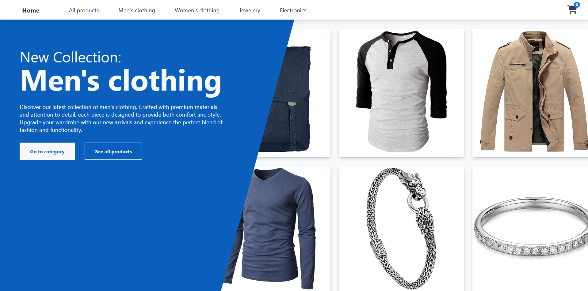

# React Shop App

React Shop App is a shopping application that divides content into pages for better navigation. The cart is managed using React Context with useReducer, which also saves the state in localStorage and synchronizes across tabs. All of the data is fetched from the Fake Store API. The app is fully responsive and designed to provide a seamless shopping experience.

Live demo - [React Shopp App](https://stupendous-bublanina-0b7510.netlify.app)

## Technologies Used
 - React 
 - Fake Store API
 - React Router
 - Font Awesome
 - Local Storage

## Scrennshot



 ## Run locally

 - Clone the repo
 - Install NPM packages ```npm install```
 - Run app ```npm run dev```
## Assets and Credits
 - **Fake Store API** by MohammadReza Keikavousi
    - **Source**: [Fake Store API](https://fakestoreapi.com/)
    - **License**: MIT License
 - **Font Awesome** by Dave Gandy 
    - **Source**: [Font Awesome](http://fontawesome.io)
    - **License**: MIT License
 - **Google Material Design Icons** for app logo
    - **Soure**: [Material Design Icons](https://material.io/resources/icons/)
    - **License**: Apache License 2.0